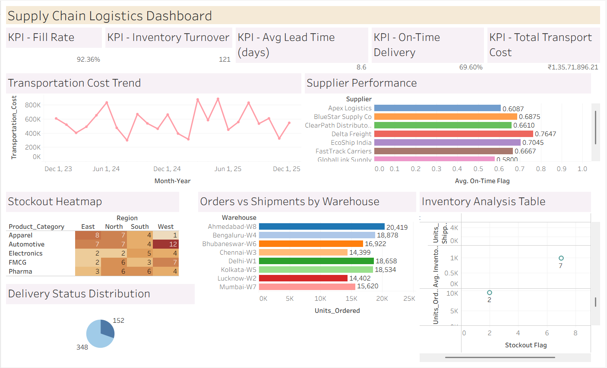

# 📦 Supply Chain Logistics & Inventory Efficiency Dashboard

> **An end-to-end Tableau project analyzing logistics performance, inventory efficiency, and supplier reliability across 8 Indian warehouses and 10 suppliers — built to simulate real-world supply chain operations.**

---

## 🖼️ Dashboard Preview



---

## 🎯 Objective

To build an interactive Tableau dashboard that enables supply chain teams, operations analysts, and logistics managers to:
- Monitor **delivery performance** and identify delay patterns
- Track **inventory efficiency** across product categories and regions
- Evaluate **supplier reliability** and on-time delivery scores
- Optimize **transportation costs** and reduce inventory holding costs
- Detect **stockout risks** before they impact operations

---

## 🛠️ Tools & Technologies

| Tool | Purpose |
|------|---------|
| **Tableau Desktop** | Dashboard design & data visualization |
| **Microsoft Excel** | Data storage & preprocessing |
| **GitHub** | Version control & portfolio hosting |

---

## 📂 Project Folder Structure

```
supply-chain-logistics-dashboard/
│
├── 📁 data/
│   └── supply_chain_logistics_dataset.csv        # 500-row cleaned dataset
│
├── 📁 tableau/
│   └── Supply Chain Logistics & Inventory Efficiency.twbx               # Tableau packaged workbook
│
├── 📁 screenshots/
│   ├── Chart 1.png
│   ├── Chart 2.png
│   ├── Chart 3.png
│   ├── Chart 4.png
│   └── Chart 5.png
│   └── Chart 6.png
│   └── Dashboard.png
│
│
└── README.md                                     # This file
```

---

## 📊 Dataset Description

**File:** `data/supply_chain_logistics_dataset.csv`
**Rows:** 500 | **Columns:** 23 | **Period:** 2024–2025

| Column | Description |
|--------|-------------|
| `Order_ID` | Unique order identifier |
| `Order_Date / Shipment_Date / Delivery_Date` | Key logistics dates |
| `Month / Quarter / Year` | Time dimensions |
| `Region` | East, West, North, South |
| `Warehouse` | 8 warehouses (Ahmedabad, Bengaluru, Delhi, etc.) |
| `Supplier` | 10 supplier companies |
| `Product_Category` | Apparel, Automotive, Electronics, FMCG, Pharma |
| `Units_Ordered / Units_Shipped` | Volume metrics |
| `Inventory_On_Hand / Reorder_Level` | Stock position |
| `Lead_Time_Days` | Avg days from order to delivery |
| `Delivery_Status` | On-Time / Delayed |
| `Delivery_Delay_Days` | Number of days delayed |
| `Transportation_Cost` | Logistics cost per order (₹) |
| `Inventory_Holding_Cost` | Cost to hold stock (₹) |
| `Demand_Forecast / Actual_Demand` | Forecasting accuracy inputs |

---

## 📐 Tableau Concepts Used

- **Calculated Fields** — Fill Rate, On-Time Delivery %, Stockout Flag, Forecast Accuracy
- **KPI Cards** — Custom text + reference lines for executive-level metrics
- **Heatmaps** — Stockout risk across product category × region matrix
- **Bar & Horizontal Bar Charts** — Supplier performance, warehouse volumes
- **Line Chart** — Monthly transportation cost trend (Dec 2023 – Dec 2025)
- **Donut Chart** — Delivery status distribution
- **Scatter Plot** — Inventory level vs. stockout flag
- **Dashboard Actions** — Cross-filtering for interactive exploration
- **Filters** — Region, Warehouse, Supplier, Product Category, Delivery Status

---

## 📈 Key KPIs (Dashboard Summary)

| KPI | Value |
|-----|-------|
| 🎯 Fill Rate | **92.36%** |
| 🔄 Inventory Turnover | **121x** |
| ⏱️ Avg Lead Time | **8.6 days** |
| ✅ On-Time Delivery | **69.60%** |
| 🚚 Total Transport Cost | **₹1,35,71,896** |

---

## 🔍 Key Insights

### 1. 🚨 On-Time Delivery is a Critical Gap
Only **69.6% of orders** were delivered on time — meaning **152 out of 500 orders were delayed**. This is well below the industry benchmark of 85–90%, indicating systemic issues in supplier reliability or lead time estimation.

### 2. 🏆 Supplier Performance Varies Sharply
- **IndoTrans Pvt Ltd** leads with an **87.7% on-time rate** — the only supplier above 80%.
- **GlobalLink Supply** is the weakest at **58%**, nearly 30 percentage points behind the top performer.
- **Apex Logistics** also underperforms at 60.9%, suggesting renegotiation or replacement may be warranted.

### 3. 📦 Ahmedabad-W8 Handles the Most Volume — But at What Cost?
Ahmedabad-W8 processed **20,419 units** — the highest among all warehouses — followed by Bengaluru-W4 (18,878) and Delhi-W1 (18,658). High-volume warehouses need proportionally stronger inventory management to avoid bottlenecks.

### 4. 🔴 Automotive in the West Region Has Highest Stockout Risk
The stockout heatmap reveals **Automotive-West** is the hottest cell with **12 stockouts** — the highest across all category-region combinations. This points to either chronic under-ordering or supply disruptions for auto parts in western India.

### 5. 📉 Apparel Has the Highest Forecast Error
Apparel shows a **Mean Absolute Percentage Error (MAPE) of 10.4%**, compared to Pharma's 9.2%. This suggests demand planning for fashion/seasonal categories needs improvement — possibly through better trend-based forecasting models.

### 6. 💰 Transportation Costs Spike in Q2 Each Year
Both 2024 Q2 (₹19.9L) and 2025 Q2 (₹19.3L) show the highest quarterly transport costs, while Q1 and Q4 are relatively lower. This seasonal pattern (likely driven by summer demand surges) can be used to pre-negotiate freight rates.

### 7. 📊 Fill Rate of 92.36% — Strong but Not Perfect
With ~7.6% of ordered units going unshipped, there is still meaningful revenue leakage. Combining this with stockout analysis can identify which warehouses or categories are most responsible for unfulfilled orders.

### 8. 🔁 Inventory Turnover of 121x Signals Fast-Moving Stock
A turnover of 121 indicates very lean inventory levels relative to shipment volumes — efficient, but potentially risky if supplier delays occur, as buffer stock is thin.

---

## 👤 Author

**Debarati Pal**  

